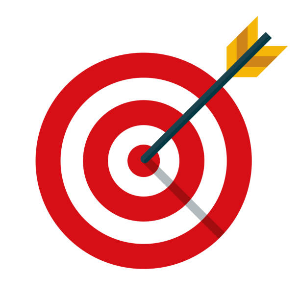

# target

`target` is a Jetpack Compose Android app for tracking personal goals, reminders, daily check-ins, profile health details, and screen-time awareness with local Room storage.

## App Image

## Features

- Create, edit, and delete targets with `from` and `to` date ranges.
- Track multiple goal categories including `Water`, `Walking`, `Wakeup`, `Sleeping`, `Money Saving`, `Book Reading`, and custom goals.
- Use the `Daily Check-in` / `Log` screen to increment, complete, or reduce progress for active goals.
- Automatically remove completed goals from the daily check-in list for the current day.
- Open `Today's Focus` items from the dashboard and jump directly to the `Log` page.
- Enable category-specific reminders, including wake-up alarms, sleep reminders, water schedule support, and custom reminder times.
- View progress, active goals, and completion stats from the dashboard.
- Manage a user profile with photo, BMI, blood group, gender, weight, and height details.
- Monitor daily screen time from the dashboard profile section with status labels and expandable guidance.
- Review missed-date reporting for incomplete goals.
- Store app data locally with Room.

## Navigation

The bottom navigation provides these top-level sections:

- `Home` - dashboard, profile summary, today's focus, screen-time widget
- `Targets` - all saved goals
- `Log` - daily check-in flow
- `Alerts` - reminder controls
- `Profile` - editable personal profile

## Permissions

- `POST_NOTIFICATIONS`: required on Android 13+ for reminders and notifications
- `PACKAGE_USAGE_STATS`: required only for the screen-time monitoring widget

If usage access is not granted, the app shows an action in the profile section that opens the system settings screen.

## Project Files

### Core app

- `app/src/main/java/com/example/shops/MainActivity.kt` - app entry point
- `app/src/main/java/com/example/shops/GoalsViewModel.kt` - UI state, Room integration, progress updates, reminders, and reports
- `app/src/main/java/com/example/shops/data/GoalDatabase.kt` - Room entities, DAO interfaces, and database setup
- `app/src/main/java/com/example/shops/model/GoalModels.kt` - goal, profile, screen-time, and UI models

### Navigation and screens

- `app/src/main/java/com/example/shops/ui/navigation/AppNavGraph.kt` - navigation graph and bottom bar wiring
- `app/src/main/java/com/example/shops/ui/screens/dashboard/DashboardScreen.kt` - dashboard and today's focus
- `app/src/main/java/com/example/shops/ui/screens/checkin/CheckInScreen.kt` - daily check-in / log page
- `app/src/main/java/com/example/shops/ui/screens/goals/GoalDialog.kt` - create/edit goal dialog
- `app/src/main/java/com/example/shops/ui/screens/profile/ProfileScreen.kt` - editable profile screen
- `app/src/main/java/com/example/shops/ui/screens/reminders/RemindersScreen.kt` - reminder management

### Components and services

- `app/src/main/java/com/example/shops/ui/components/SharedComponents.kt` - shared cards, chips, and bottom navigation
- `app/src/main/java/com/example/shops/ui/components/profile/ProfileComponents.kt` - dashboard profile header and screen-time widget
- `app/src/main/java/com/example/shops/ui/components/GoalFormatting.kt` - goal formatting helpers
- `app/src/main/java/com/example/shops/reminders/ReminderReceiver.kt` - notification receiver
- `app/src/main/java/com/example/shops/reminders/ReminderScheduler.kt` - alarm scheduling and cancellation
- `app/src/main/java/com/example/shops/reminders/ReminderPopupActivity.kt` - reminder popup UI
- `app/src/main/java/com/example/shops/screen/ScreenTimeMonitor.kt` - daily screen-time calculation using usage stats

### Build and config

- `app/build.gradle.kts` - app module configuration and dependencies
- `build.gradle.kts` - root Gradle configuration
- `settings.gradle.kts` - Gradle module settings
- `gradle/libs.versions.toml` - version catalog
- `app/src/main/AndroidManifest.xml` - permissions and Android components

## Run It

1. Open the project in Android Studio.
2. Sync Gradle dependencies.
3. Run the `app` configuration on an emulator or Android device.
4. Allow notification permission on Android 13+ if you want reminders.
5. Grant usage access from system settings if you want screen-time monitoring.

## Notes

- App label: `target`
- Local database: Room
- Screen time shows only the current day's usage
- Screen-time details are collapsed by default and can be expanded from the dashboard profile section
